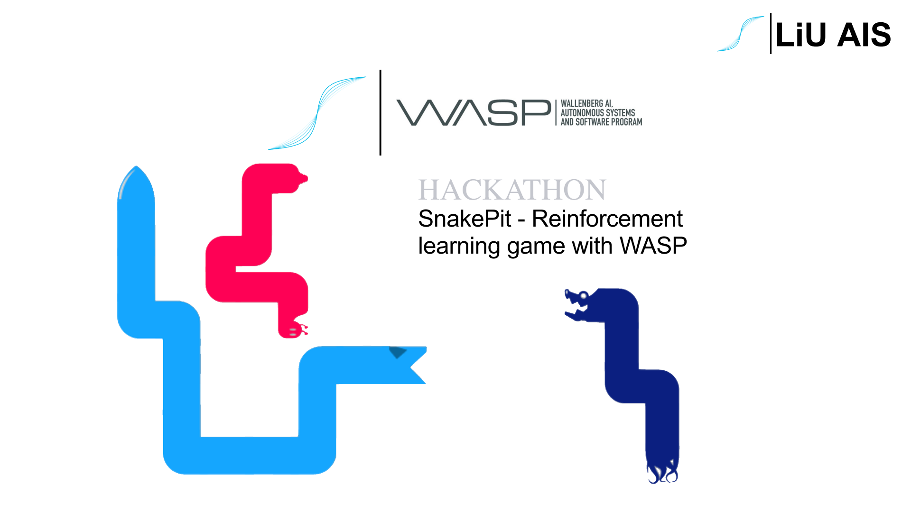
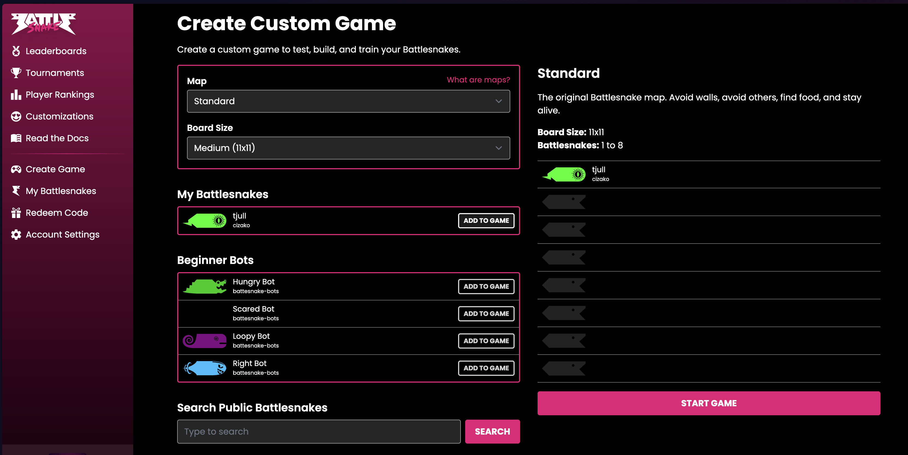

# Snake Pit 

Welcome to the **Snake Pit** — a fun and educational event where you train your own intelligent snake using reinforcement learning and pit it against others!

This project uses a custom Battlesnake Gym environment and supports PPO. It's built for students and ML enthusiasts to compete by evolving their snakes using machine learning.

---


## 📦 Requirements
Install dependencies:
```bash
pip install -r requirements.txt
```

## Setup and ngrok and BattleSnake
🔧 [Setup](docs/setup.md)
---


## 🎓 Training Your Snake

### Basic Training

The simplest way to start training is:
```bash
python train.py
```

### Advanced Training Options

```bash
python train.py [options]
```

Available options:
```bash
--total-timesteps INT             # Number of training episodes (default: 500)
--map-size INT INT        # Board dimensions (default: 11 11)
--save-interval INT       # Save model every n episodes (default: 500)
--visualize-interval INT  # How often to show visualization (default: 10)
--pretrained PATH        # Load pretrained model path (e.g., runs/run01/ppo_final.pt)
--opponents LIST         # List of opponent modules to train against
--plot-every INT        # Plot training stats every n episodes (default: 100)
--our-snake-name STR    # Name for your snake (default: "Our snake")
--continue-when-dead    # Continue episode after agent death (default: False)
--mute                 # Disable sound effects (default: False)
--no-visualize        # Disable visualization completely
```

### Training Examples

1. Basic training with visualization:
```bash
python train.py --episodes 1000 --visualize-interval 10
```

### 🚀 Deploy Snake to BattleSnake

#### 1. Launch Server
Start the Flask server with your trained model (found under runs/runXX/ppo_epxx.onnx), e.g:
```bash
python launch.py --model runs/run1/ppo_final.onnx 
```

Available options:
```bash
--model PATH          # Path to your ONNX model file (required)            # Enable debug mode
```

#### 2. Launch a game

Head over to [Create Game](https://play.battlesnake.com/account/games/create)




##  How to make your snake better!!!
🔧 [Customize Your Snake](docs/customization.md)


### 4. Visualize and Debug

During training, you can watch the snake via a Pygame window. Statistics are saved automatically:
- `training_stats.png`

---


---

## 🧪 How the Environment Works
### Observation Format

The observation is a 3-channel 2D grid of shape `(height, width, 3)`, where each channel represents a different element on the Battlesnake board:

| Channel | Meaning            | Values     | Description                                                  |
|---------|--------------------|------------|--------------------------------------------------------------|
| 0       | Food               | `1`        | Cells containing food are marked with `1`                   |
| 1       | Your Snake         | `1` / `5`  | Body segments are `1`, head is `5`                          |
| 2       | All Other Snakes   | `1` / `5`  | Same encoding as your snake: body `1`, head `5`             |

- All other positions are filled with `0`.
- This encoding is updated every turn based on the current game state.
- It allows the neural network to differentiate between objectives (food), danger (other snakes), and self-location.


## 📁 Project Structure This needs to be updated

```
.
├── train.py         # Training loop
├── launch.py     # Server for playing
├── Gym/                   # Battlesnake gym
├── ppo.py                 #  PPO model 
├── visualize.py           # Pygame GUI drawing
├── snakes/                # Opponent agents
├── runs/                  # Saved runs + plots
└── requirements.txt
```

---

## 🏆 Competition Format

- Competition will be performed in Group stage and bracket stage
- Played 11x11 format
- You can train locally and then run the model using launch.py script.
- You will compete against other snakes

---

