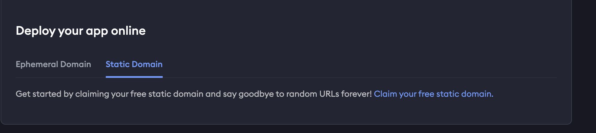
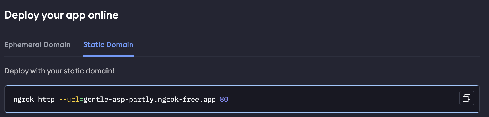
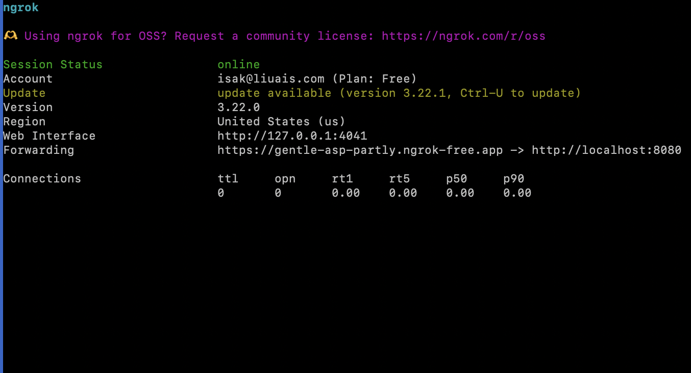
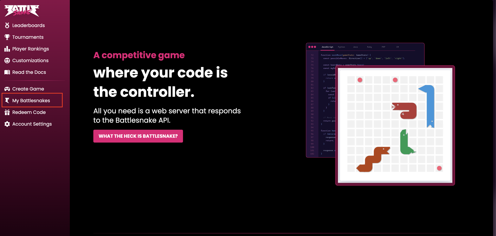
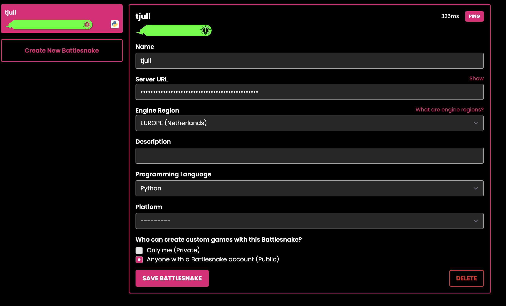

# 🚀 Exposing a Local Server with ngrok 
To be able to use your Snake on the [BattleSnake](https://play.battlesnake.com/) website you must setup a server that hosts the functions responsible for your snake. An easy way of doing so is by setting up a ngrok server that listens to a localhost port.
Follow these steps to use [ngrok](https://ngrok.com) to expose a local server to the internet.

## 🔧 Prerequisites

- Python, Node.js, or any other server running locally (e.g., `localhost:5000`)
- ngrok installed (instructions below)

- ## 📦 Step 1: Install ngrok

### Option 1: Download from Website

Go to [https://ngrok.com/download](https://ngrok.com/download), download the binary, and unzip it.

### Option 2: Install via Homebrew (macOS)

```bash
brew install ngrok/ngrok/ngrok
```

### Option 3: Install via Chocolatey (Windows)

```bash
choco install ngrok
```

### Option 4: Install via Apt (Linux)
```bash
curl -sSL https://ngrok-agent.s3.amazonaws.com/ngrok.asc \
  | sudo tee /etc/apt/trusted.gpg.d/ngrok.asc >/dev/null \
  && echo "deb https://ngrok-agent.s3.amazonaws.com buster main" \
  | sudo tee /etc/apt/sources.list.d/ngrok.list \
  && sudo apt update \
  && sudo apt install ngrok
```

## 📦 Step 2: Create ngrok account and follow instructions for installation
Go to [https://dashboard.ngrok.com/signup](https://dashboard.ngrok.com/signup), and setup your account.


## 📦 Step 3: Configure and deploy ngrok
Copy the authtoken found on the dashboard after creating an account in the previous step. Configure your ngrok with the following command.
```bash
ngrok config add-authtoken <token>
```

## 📦 Step 4: Click the static domain and claim free static domain


## 📦 Step 5: Paste the command in to your terminal. The last digits are which ports the ngrok server listens to. We have it to default at 8080 so, change it 8080




This will be the output:



Copy the url in the Forwarding. This is the domain name

## Do not close the terminal window running this command. It has to be active for the server to be running


## 📦 Step 4: Create BattleSnake account
Head over to [https://play.battlesnake.com/](https://play.battlesnake.com/) and create your account

## 📦 Step 4: Create a Snake and link to server url

Under My battlsnake, click on create BattleSnake. 




Fill in with prefered name etc. Under Server URL, make sure to print the previously made ngrok domain name. 





## Now your snake is ready for deployement

Go back to [README](../README.md) for next set of instructions
